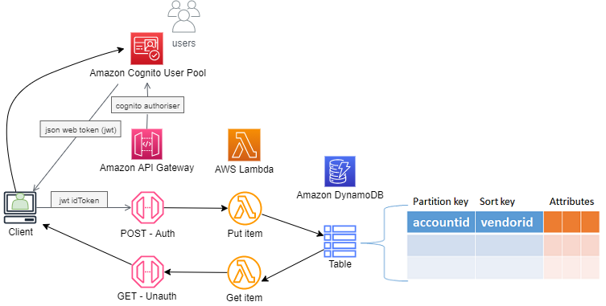

This example is designed for a concept mobile application called Skip the Line, which allows user to pre-order takeaway coffee while they are in transit. Just as the train pulls into the station, the user can order a coffee and pick it up on the way past the coffee shop.

This example deploys a microservice which uses an API Gateway endpoint, AWS Lambda functions, a DynamoDB table and an Amazon Cognito user pool as an authoriser. The POST method on the API Gateway allows authenticated requests only. This ensures that only authenticated users can POST a new order. The Amazon DynamoDB table is partitioned on an accountid attribute and also includes a sort key on the vendorid attribute, together they form the primary key. 

Using a Jupyter Notebook and the Cognito SDK you will create and authenticate a new Amazon Cognito user. With the jwt returned by Cognito, you will send a request to an API endpoint the only accepts authenticated requests.




## Setup

You will need to download and install [Node.js](https://nodejs.org/en/download/) before you can start using the AWS Cloud Development Kit.

This example is developed using the AWS CDK and Typescript, so you will need to install both Typescript and the CDK using the following commands
```
npm install -g typescript
npm install -g aws-cdk@latest
```
Since this CDK project uses ['Assests'](https://docs.aws.amazon.com/cdk/latest/guide/assets.html), you might need to run the following command to provision resources the AWS CDK will need to perform the deployment.

```bash 
cdk bootstrap
```

The testing scripts can be executed using Jupyter Notebook. There are a few methods for installing Jupyter Notebooks. These instructions will help you get to started with [JupyterLab](https://jupyter.org/install) installation. 

You can also install Jupyter Notebooks as part of [Anaconda](https://docs.anaconda.com/anaconda/install/index.html) installation.

To download this example, you will need to install [Git](https://github.com/git-guides/install-git). After installing git follow these [instructions](https://github.com/git-guides/git-clone) to learn how to clone the repository.

After the repository has been cloned set the command prompt path to the cloned directory and run the following command to install the project dependencies.

```bash
npm install
```

**cdk synth** executes the application which translates the Typescript code into an AWS CloudFormation template.

```bash
cdk synth
```

After the synth command has generated the template use the  **cdk deploy** command to deploy the template to AWS CloudFormation and build the stack. You will be prompted to confirm the deployment with y/n.

```bash
cdk deploy
```
## Test the Stack
We need to install Jest since we are using the Jest framework to test the stack. Testing the stack is optional.
```
npm install --save-dev jest @types/jest @aws-cdk/assert
```

## Run the Example
Open the Jupyter Notebook in the **jupyter_notebook directory** follow the instructions.

## Cleanup
From the command prompt execute the following command: **cdk destroy**
